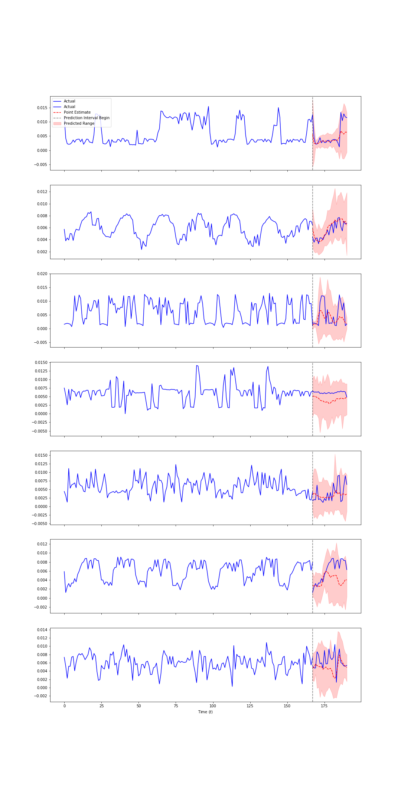
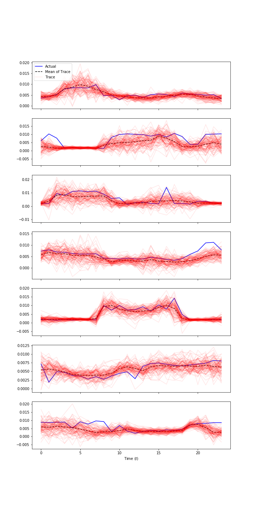

# Deep Learning for Time Series

[Recurrent Neural Networks](https://en.wikipedia.org/wiki/Recurrent_neural_network) (RNNs), a deep learning architecture designed to operate on sequences of data, seem like a natural fit for modeling time series. Most of the literature, however, has focussed on applying RNNs strictly within the realm of natural language proccessing (NLP). In this post we'll dive into [a model that introduces a framework that bridges this gap](https://arxiv.org/abs/1704.04110).

# Overview

The essential components of the model, referred to as *DeepAR* by the authors, can be summarized in three points.

## [Same as the old boss](https://www.youtube.com/watch?v=zYMD_W_r3Fg)

One of the things I really like about this paper is that it doesn't introduce anything new - assuming a familiarity with mainstream deep learning techniques in NLP and basic ideas from probability such as maximum likelihood estimation, that is. Rather DeepAR is just a vanilla encoder/decoder (built with vanilla LSTMs) combined with some other well known ideas.

**Aside**: Explaining enocoder/decoders is beyond the scope of this post. For an introduction to this topic, I highly recommend [this talk](https://www.youtube.com/watch?v=G5RY_SUJih4) which gives one of the best introductions to the topic, in my opinion. The talk is thorough and correspondingly over an hour long. For readers interested in a reference that requires less time commitment, [this ten-minute introduction to sequence to sequence learning](https://blog.keras.io/a-ten-minute-introduction-to-sequence-to-sequence-learning-in-keras.html) on the keras blog is a good place to start.

## Thinking probabilistically

The second thing to understand about DeepAR is what the model outputs.

Although DeepAR is a framework for time series it doesn't attempt to predict scalar values. Rather it outputs scalar values that are interpreted as parameters of a user specified taraget distribution. For example, if the data is real valued the user may choose to output two values representing the mean and standard deviation of a [guassian distribution](https://en.wikipedia.org/wiki/Normal_distribution). Alternatively parameters of a [negative binomial distribution](https://en.wikipedia.org/wiki/Negative_binomial_distribution) might be the outputs of the model if the underlying data represents counts. While these two distributions are mentioned specifically in the paper, the authors suggest that there is no reason to assume that other distributions couldn't be used just as readily.

Given this setup, the model learns to maximize the corresponding likelihood (technically negative log likelihood) function given the "predicted" parameters and actual values of the time series $z_{i}$.

This is accomplished by adding one "dense layer" for each distribution parameter on top of the outputs of the decoder LSTM. Concretely, if $h_{i,t}$ is an output sequence from the decoder ($i$ corresponds to the training example and $t$ to the time step) then we obtain the distribution parameters, e.g. of a guassian, as

$$
\begin{align}
&\mu(h_{i,t})=w_{\mu}^{T}h_{i,t}+b_{\mu} \\
&\sigma(h_{i,t})=\log(1+\exp(w_{\sigma}^{T}h_{i,t}+b_{\sigma}))
\end{align}
$$

Note the softplus activation used in $\sigma(\cdot)$ used to ensure the standard deviation is positive and non-zero.

### Relation to NLP

It's worth some pause to consider the benefits of framing the problem this way.

I'm obviously (if you've read some of my other posts) a fan of probabilistic models for all of the usual reasons (uncertainty estimates, etc.). But aside from that, what I like most about the probabilistic approach is how well it aligns with the framing in NLP applications.

In NLP, an encoder/decoder is also trained, using a softmax as the objective function, so that the model learns the parameters of a probability distribution - i.e. the parameters of a [categorical distribution](https://en.wikipedia.org/wiki/Categorical_distribution), namely the probabilities of tokens (words, characters, etc.).

This is an important connection. Especially at run time, when it comes time to generate forecasts probabilistically, as it provides a much tighter analogy to the well studied approaches in NLP. If it isn't clear why this is the case, see [this section](https://youtu.be/G5RY_SUJih4?t=1325) of the talk already linked above.

## Handling industry concerns

Lastly, DeepAR introduces a scheme for scaling the inputs and outputs of the model and selecting which examples are included at train time.

The rationale for scaling the inputs/outputs is as follows (quoting directly from the paper)

    Firstly, due to the autoregressive nature of the model, both the autoregressive input $z_{i,t-1}$ as well as the output of the network (e.g. $\mu$) directly sccale with the observations $z_{i, t}$, but the non-linearities of the network in between have a limited operating range. Without further modifications, the network thus has to learn to scale the input to an appropriate range in the input layer, and then invert this scaling at the output.
    
This sort of scaling is a common problem in regression. To address this issue the time series inputs to both the encoder and decoder are scaled by the average value of the time series inputs of the encoder (remember the inputs to the decoder are only known at train time, hence we compute the scaling factor, denoted $\nu_{i}$ from the encoder inputs only).

Additionally, this scaling factor serves another purpose: selecting which examples are used to train the model. That is, rather than include all data at train time, a subset of the data is sampled to reach a fixed number of examples (e.g. 500K) where the probability that an example is chosen is proportional to $\nu_{i}$.

In my opinion this is a really important feature of the framework because it was introduced to address real world concerns that are encountered in industry. Quoting from the paper

    [D]ue to the imbalance in the data, a stochastic optimization procedure that picks training instances uniformly at random will visit the small number time series with a large scale very infrequently, which result in underrfitting those time series. This could be especially problematic in the demand forecasting setting, where high-velocity items can exhibit qualitatively different behavior than low-velocity items, and having an acccurate forecast for high-velocity items might be more important for meeting certain business objectives. To counteract this effect, we sample the examples non-uniformly during training.

Considering the paper is written by researchers at Amazon it shouldn't be a surprise that business implications were explicity accounted for.

## Downsides

To conclude the overview, it should be noted that deploying this model into a real-time forecast environment is nontrivial. This is a feature of the autoregressive and probabilistic nature of the model.

The autoregressive component requires the model to make a prediction for each time step in the prediction range *sequentially* while the probabalistic component requires us to run through this process several times. Thus in practice obtaining a "final" prediction, whether point estimates or confidence intervals or both, requires us to through the entire *decoder* (and depending on your deep learning framework, the entire *encoder* as well if you don't want to write custom code) $nm$ times where $n$ is the number of time steps and $m$ is the number of traces you want to generate. Here, a trace is the sequence of outputs from the decoder obtaained by using samples from the predicted distribution parameters at each time step as the autoregressive inputs to the model at the next step.

While we can easily "parallelize out" $m$ in theory, it is not so for $n$. Moreover parallelizing the traces would require deploying multiple machines, or one *very* large machine - keep in mind that the results published in the paper use 200 traces. In my experiments 30 was "pretty good" and 100 was "good enough."

Having stated these concerns, it's necessary to point out that DeepAR is an [AWS Service](https://docs.aws.amazon.com/sagemaker/latest/dg/deepar.html) via Sagemaker.

To reiterate, again, this discussion only applies to real-time forecasting as opposed to batch processing where latency requirements are typically more lax.

# Implementation

Like all papers, I ran into a few quirks when trying to reproduce the results in the paper on the [electricity data set](https://archive.ics.uci.edu/ml/datasets/ElectricityLoadDiagrams20112014). Those quirks are documented here for the benefit of others.

## Convergence

My experiments consisted of replicating DeepAR and a modification thereof - weighted sampling scheme with distribution parameters left unscaled when computing the likelihood, similar to *rnn-guassian* in the paper.

In both cases I ran into issues with [underflow/overflows](https://en.wikipedia.org/wiki/Arithmetic_underflow).

Initially, when training with scaled distribution parameters in the loss function the gradients were computed as 0 and consequently the model parameters were never updated.

When training without scaled distribution parameters, the model would nearly reach convergence after 5 or 6 epochs before everything turned to `NaNs`.

The solution for (almost) both of these issues was to enforce all network data types to be `float64` (in keras `tf.keras.backend.set_floatx('float64')`) and rewrite my naive implementation of the negative guassian log likelihood.

In other words, rather than implementing the loss naively as two functions, e.g. `def guassian_likelihood()` and `def negative_log_likelihood()`, implementing a single function of the simplified negative log likelihood,

$$
-\log\left(\frac{1}{\sigma\sqrt{2\pi}}e^{-\frac{(z-\mu)^{2}}{2\sigma^{2}}}\right)=\frac{1}{2}\log{2\pi} + \log{\sigma} + \frac{(z - \mu)^{2}}{2\sigma^{2}},
$$

and then removing terms independent of the model parameters to obtain

$$
\log{\sigma} + \frac{(z - \mu)^{2}}{2\sigma^{2}}
$$

did the trick.

With `keras/tensorflow`, this is just

```python
def guassian_neg_log_likelihood(z, mu, sigma):
    return tf.math.log(sigma + epsilon) + (((z - mu) ** 2) / (2 * sigma ** 2))
```

The key here was removing the exponential from the loss. 

This did resolve the underflow of the computed loss when using the scaled parameters, however the model never converged and I wasn't fully to fully replicate the DeepAR results. (Although I have a few hunches as to how to fix this that I haven't had time to try yet).

Using `float64`s and rewriting the loss was sufficient for the simpler model with unscaled likelihood parameters however and gave results good enough for me to move on for the time being.

For the full details, you can find a `jupyter` notebook with the full implementation on my GitHub linked at the bottom of this page.

## Scaling

In the paper the definition of the scale factor is

$$
\nu_{i}=1+\frac{1}{t_{0}}\sum_{t=1}^{t_{0}}{z_{i}}
$$

where $t_{0}$ denotes the final time step of the "conditioning range", i.e. time steps known at run time.

Initially I incorrectly implemented this as 1 plus the sum of the time series instead of 1 plus the average. However, at least for the electricity data set, this yielded better results so I stuck with it.

# Results

Of course, no post is complete without pictures, so here they are. Here are some predictions from my experiments on the electricity data set for 10 randomly selected examples in the test set.



Another way I like to look at the predictions is to overlay each trace on top of the actual predictions. Here's that view for the same 10 examples above for the prediction range only.


